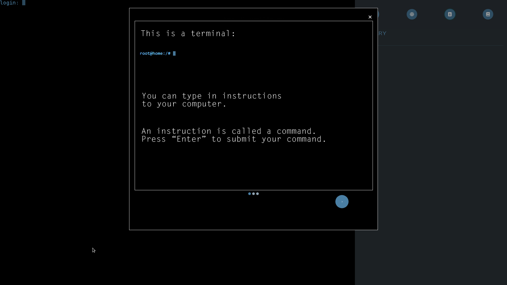
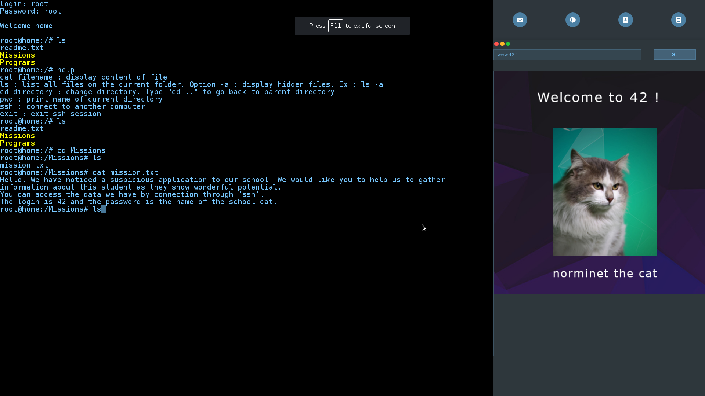
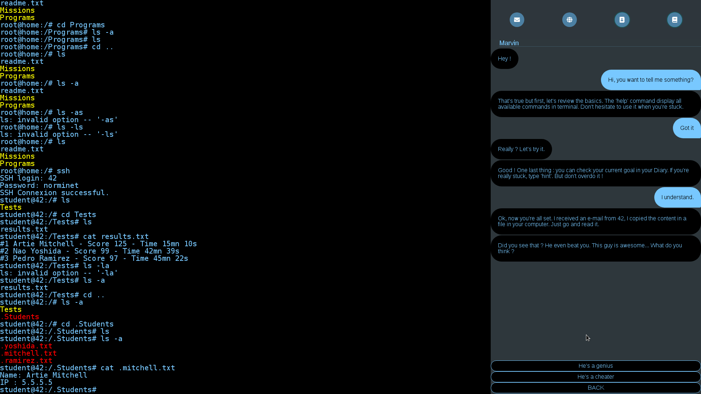

# Hacking game: Red Bull challenge

## A puzzle game to learn the basics of computer science

## this game was made for a challenge offered by redbull. Works on desktop browser and mobile. It used HTML, CSS and JS technologies

### Introduction of the game

### Norminet the cat

### Dialog Box

## To test it

* Download a functionnal version of node JS
* Put all the downloaded content into the projet node subdirectory
* Enter *./launch_server*
* Connect your browser to the given address. ex: *192.168.1.53:8080*
* Enjoy
